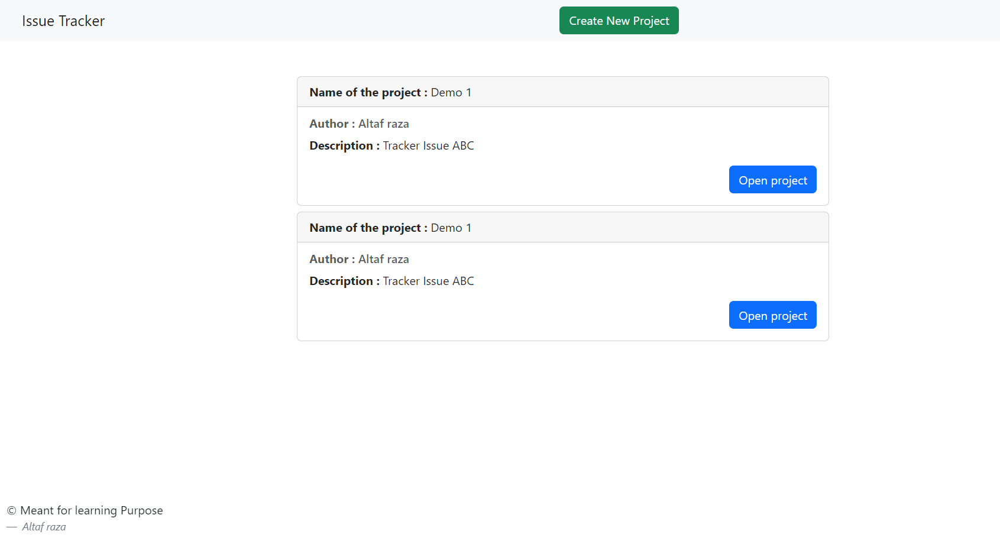

# Issue Tracker Web App

## Overview

The Issue Tracker Web App is a web-based platform designed to help manage projects and track issues/bugs effectively. It allows users to create projects, add issues, filter and search for issues, and visualize project-related information.



## Features

- **Project Management:**

  - Create new projects with details like name, author, and description.
  - View a list of existing projects.

- **Issue Tracking:**

  - Add issues to projects with details such as title, description, author, and labels.
  - View a list of issues associated with a project.

- **Filtering and Searching:**

  - Filter issues based on author, labels, or a combination of criteria.
  - Search for issues using keywords in titles or descriptions.

- **User-Friendly Interface:**
  - Intuitive and responsive design for ease of use.
  - Modal forms for creating projects and issues.

## Tech Stack

- **Frontend:**

  - HTML, CSS, Bootstrap
  - JavaScript (Vanilla)

- **Backend:**

  - Node.js
  - Express.js

- **Database:**
  - MongoDB with Mongoose

## Getting Started

1. **Clone the repository:**

   ```bash
   git clone <repository-url>
   cd issue-tracker-web-app
   ```

2. **Install Dependencies:**

   ```bash
   npm install
   ```

3. **Configure Database:**

   - Create a MongoDB database and update the connection URL in `config/mongoose.js`.

4. **Run the Application:**

   ```bash
   npm start
   ```

5. **Access the App:**
   Open a web browser and go to `http://localhost:8000/`.

## Usage

1. **Creating a Project:**

   - Click on "Create New Project" to add a new project.

2. **Viewing Projects:**

   - The home page displays a list of existing projects.

3. **Project Details:**

   - Click on "Open project" to view details of a specific project, including its issues.

4. **Creating an Issue:**

   - In the project details page, click on "Create Issue" to add a new issue to the project.

5. **Filtering and Searching:**
   - Use the provided buttons to show all issues, filter by criteria, or search for specific issues.

## Contribution

Contributions are welcome! If you find a bug or have an idea for an improvement, feel free to open an issue or submit a pull request.
